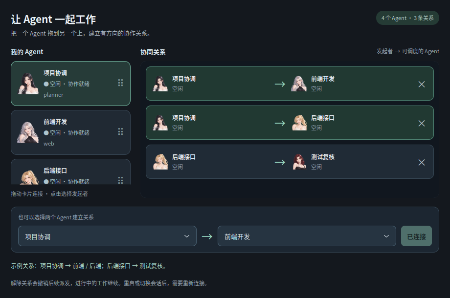
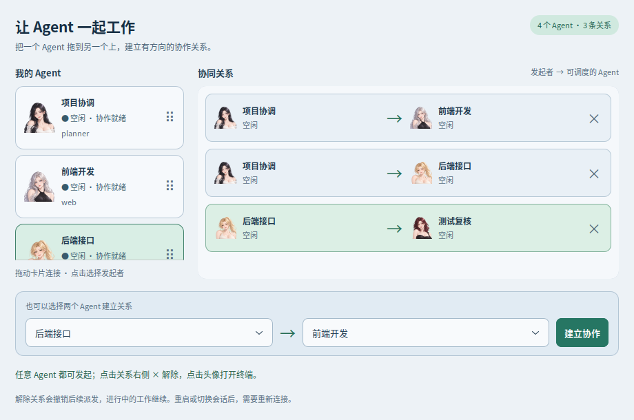
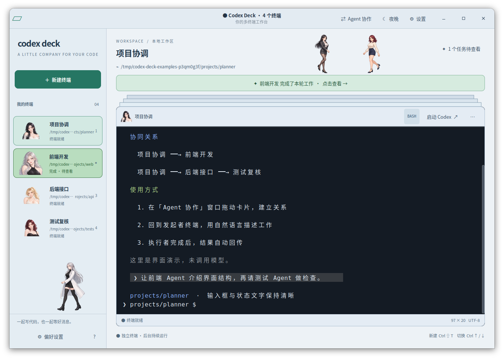

# Codex Deck

面向 Codex 的多终端桌面工作台：左侧角色标签、动态堆叠、任务完成提醒和二次元桌面宠物。

支持 Ubuntu 图形桌面；Windows 可通过 WSL2＋WSLg 使用（WSL 尚未实测）。

**[Ubuntu／WSL 安装与使用](INSTALL.md)**


*真实应用窗口，使用示例项目和演示完成提醒。*

## 功能

- 每个终端单独选择项目目录，后台任务持续运行。
- 左侧加号新建，右键重命名、换头像、关闭终端。
- 动态堆叠与平滑切换，支持 `Ctrl+↑/↓`、`Alt+1～9`。
- Codex 一轮结束后头像放大闪烁，点击确认，可选提示音。
- 十款内置头像，支持导入自己的头像集。
- 日间／夜晚主题、字号调整和设置保存；日间使用浅色界面与高对比深色终端。
- 三套二次元女伴宠物，支持步行、攀爬、眨眼；可选角色、大小和数量，也可关闭。
- Agent 协作：拖动 Agent 卡片建立有方向的关系，任意终端都可发起；在终端中描述工作，完成后自动回传结果。

## Agent 协作

**实验功能：已完成真实双终端的任务派发、执行与结果回传验证。**

1. 使用支持 `--remote` / App Server 的 Codex CLI，在两个或更多标签中启动 `codex`。
2. 点击顶部 **Agent 协作**，把发起者卡片拖到另一个 Agent 上；也可用下方选择器连接。
3. **A → B** 表示 A 可以指挥 B；在 A 的终端中描述“让 B 介绍项目”，即可派发。
4. 执行者忙碌时排队，完成后结果回到原发起者。面板只展示协同关系，点击 **×** 解除，点击关系中的头像打开终端。

每条关系都是单向的，反向关系需单独建立。关闭、重启或切换 Codex 会话会撤销相关授权；解除关系会取消尚未派发的工作，已执行的工作继续，可在发起者终端要求取消。原有 Codex 审批仍在执行者终端处理。同目录并行工作时请分配不同文件，或选择不同 worktree。

**历史上下文**：派发使用执行者当前 Codex 会话的 `threadId`，在同一对话中增加一轮任务，不新建或清空其历史。发起者的完整聊天记录不会自动复制过去，只传任务内容，结果回到发起者原会话。上下文压缩和长期记忆仍由 Codex 管理。

`--restore` 只恢复终端列表、目录和头像，不会自动恢复 Codex 对话。需要继续历史对话时，在终端中使用 `codex resume` 选择原会话，再重新建立协作关系。

协作模式中的 `/resume` 和 `codex resume` 默认查询当前项目的历史，搜索和翻页也使用相同目录。原生远程界面仍可能显示 `Filter: All`，工作台会在查询时补上项目范围。需要跨项目查找时，先退出当前 Codex，再运行 `codex resume --all`。

协作使用本机 App Server 和 MCP，不修改全局 Codex 配置。App Server 仍属实验接口，升级 CLI 后可运行下面的真实协作检查。普通模式可用 `codex --no-daemon`，该模式不接入协作。

历史会话选择器使用独立连接；工作台将它与主界面一起连接到同一个本机 App Server，打开或关闭历史列表不会断开主会话。遇到选择器连接报错时，可运行 `/usr/bin/python3 scripts/check_session_picker.py` 生成连接检查结果（不调用模型）。

目录筛选可运行 `/usr/bin/python3 scripts/check_resume_filter.py` 检查，覆盖界面内 `/resume`、命令行 `resume` 和 `resume --all`（不调用模型）。

## 使用示例

**夜间协同关系**：把发起者卡片拖到另一个 Agent 上建立连接，也可用下方选择器；箭头表示指挥方向，点击 **×** 解除。



**日间协同关系**：浅色卡片与清晰的关系箭头，任意 Agent 都可以成为发起者。



**日间工作区**：浅色外框搭配深色终端，保持输入框和状态文字清晰；侧栏展示独立终端及完成提醒。



*以上图片由真实 GTK 界面绘制生成，使用示例终端、协同关系和完成提醒，未调用模型。*

## 启动

安装依赖后，在项目目录执行：

```bash
bash install.sh            # 安装桌面入口和 codex-deck 命令，无需 sudo
codex-deck                 # 以后可从任意目录启动，也可使用 Ubuntu 应用菜单
codex-deck --cwd .         # 直接打开当前项目
```

源码目录直接启动也可继续使用：

```bash
bash launch.sh
bash launch.sh --shell      # 只开普通终端
bash launch.sh --restore    # 按保存的目录重新打开终端
```

关闭应用会结束其中的进程；恢复功能不恢复运行中的任务或 Codex 对话。完成提醒适用于工作台内启动的本机 Codex。

更新源码后再次运行 `bash install.sh`；卸载用 `codex-deck --uninstall`，保留设置与自定义头像。

## 开发验证

```bash
sudo apt install python3-pil
/usr/bin/python3 -m unittest discover -s tests -v
bash launch.sh --smoke-test artifacts
```

界面测试需要图形桌面，使用临时终端及测试通知，不调用模型。原始素材不随仓库发布，对原图的可选校验会跳过。

真实双 Agent 验证（需要图形桌面和 Codex 登录，会产生简短模型调用）：

```bash
/usr/bin/python3 scripts/check_coordination.py
```

源码版任务记录保存在 `.state/coordination.json`；安装版设置、头像和任务记录默认保存在 `~/.local/state/codex-deck/`，不会上传到 Git。协作开关约束 Deck 的工具和派发行为，不替代操作系统对同一用户进程的隔离。

运行资源位于 `assets/`。原始素材、备份、运行状态及测试截图已加入 `.gitignore`；README 展示图保存在 `docs/images/`。重新处理素材时，另需安装 `python3-numpy`、`python3-opencv`。

在图形桌面运行 `/usr/bin/python3 scripts/capture_readme.py` 可重新生成展示图；使用独立的示例终端，不调用模型或保存个人会话。

运行 `/usr/bin/python3 scripts/capture_readme_examples.py` 可检查关系操作并生成日间、夜间协作与日间终端三张示例截图，同样不调用模型。
