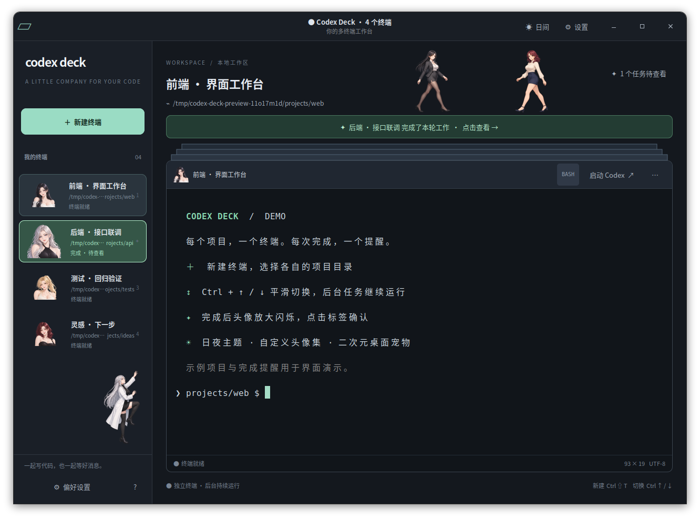

# Codex Deck

面向 Codex 的多终端桌面工作台：左侧角色标签、动态堆叠、任务完成提醒和二次元桌面宠物。

支持 Ubuntu 图形桌面；Windows 可通过 WSL2＋WSLg 使用（WSL 尚未实测）。

**[Ubuntu／WSL 安装与使用](INSTALL.md)**



*真实应用窗口，使用示例项目和演示完成提醒。*

## 功能

- 每个终端单独选择项目目录，后台任务持续运行。
- 左侧加号新建，右键重命名、换头像、关闭终端。
- 动态堆叠与平滑切换，支持 `Ctrl+↑/↓`、`Alt+1～9`。
- Codex 一轮结束后头像放大闪烁，点击确认，可选提示音。
- 十款内置头像，支持导入自己的头像集。
- 日间／夜晚主题、字号调整和设置保存。
- 三套二次元女伴宠物，支持步行、攀爬、眨眼；可选角色、大小和数量，也可关闭。

## 启动

安装依赖后，在项目目录执行：

```bash
bash launch.sh
bash launch.sh --shell      # 只开普通终端
bash launch.sh --restore    # 按保存的目录重新打开终端
```

关闭应用会结束其中的进程；恢复功能不恢复运行中的任务。完成提醒适用于工作台内启动的本机 Codex。

## 开发验证

```bash
sudo apt install python3-pil
/usr/bin/python3 -m unittest discover -s tests -v
bash launch.sh --smoke-test artifacts
```

界面测试需要图形桌面，使用临时终端及测试通知，不调用模型。原始素材不随仓库发布，对原图的可选校验会跳过。

运行资源位于 `assets/`。原始素材、备份、运行状态及测试截图已加入 `.gitignore`；README 展示图保存在 `docs/images/`。重新处理素材时，另需安装 `python3-numpy`、`python3-opencv`。

在图形桌面运行 `/usr/bin/python3 scripts/capture_readme.py` 可重新生成展示图；使用独立的示例终端，不调用模型或保存个人会话。
